<div align="center">

# wechat-ex-fusion

**把前任做成微信里的 AI —— 微信聊天记录导出 · 前任人设创作 · 微信↔Claude Code 桥接**

[](LICENSE)
[](https://nodejs.org)
[](https://python.org)

</div>

---

## ✨ 亮点

| 亮点 | 说明 |
|---|---|
| **双模式 · 完全隔离** | 聊天模式（前任人设）与任务模式（`/task` 中性助手）彼此独立：各自的 Claude 会话、各自的工作目录、各自的记忆。切过去聊正事，**绝不会污染** Ta 的人设与你们的聊天氛围。 |
| **会话按模式 × 时间分区** | 聊天 / 任务各存各的对话档，文件名带起始时间（如 `chat-20260905-000835.json`）。`/clear` **只清当前模式**、开新档案，另一模式原样保留，旧档留盘可查。 |
| **`/update` 人设自动沉淀** | 聊得越久，人设越像。`/update` 只读最近聊天，增量蒸馏进 persona + 记忆，自动留版本可回滚；系统回执与任务消息**永不写回**对话档案。 |
| **扫码即用 · 数据全本地** | 不用注册、不用服务器，微信扫码绑定一分钟搞定。所有会话、人设、记录都在你自己电脑上。 |
| **消息不刷屏** | 只推送进度、结果、关键决策；工具调用等噪音自动过滤。 |
| **双向文件** | 发图片 / Word / PDF 给 AI；AI 生成的文件也直接推回微信。 |
| **「对方正在输入中…」** | AI 处理时，微信顶部实时显示输入状态。 |

---

## 🧩 三块构成

```
wechat-ex-fusion/
├── wechat-claude-code/          # ③ 微信绑定桥（连微信 ↔ Claude Code CLI）
├── skills/
│   ├── wechat-chat-export/      # ① 微信聊天记录导出（自研）
│   └── create-ex/               # ② 前任人设创作（上游 ex-skill）
├── scripts/run.mjs              # 跨平台入口（setup/start/stop/extract/persona）
└── docs/images/                 # 教学截图
```

三步协作：**① 导数据**（wechat-chat-export）→ **② 造人设**（create-ex）→ **③ 挂在微信上聊**（wechat-claude-code）。

---

## 📋 前置条件

- **Node.js ≥ 18**（[下载 LTS](https://nodejs.org/en/download)）——**必须先装**，整个系统靠 Node.js 运行；没装的话终端输 `npm` 会报「不是内部或外部命令 / command not found」。装好后用 `node -v` 验证。
- **Claude Code CLI** 已安装并完成认证（[官方指南](https://docs.anthropic.com/en/docs/claude-code)）；需在 `~/.claude/skills/` 下能看到自定义 skill
- **Python 3.9+**（仅「提取信息」步骤用；用于调用 PyWxDump）
- **个人微信账号**（扫码绑定）
- 需要 Python 可选：`pip3 install pywxdump`（提取微信记录时用，也可由 skill 自动装入）

> Claude Code 支持第三方 API（OpenRouter、AWS Bedrock 等），设置 `ANTHROPIC_BASE_URL` 和 `ANTHROPIC_API_KEY` 即可。

> ⚠️ **这个项目从头到尾都跑在 Claude 上**——人设聊天、任务助手、导出/建人设的 skill,全都要调用本机的 Claude。**没有 Claude 就没有任何功能。** 如果你还没有 Claude Code CLI,可以在 **B 站搜「claude cc-switch」**:cc-switch 是一个第三方 API 切换工具,能帮你低成本接上能用的 Claude 模型(OpenRouter、第三方中转、Bedrock 等),配好 `CLAUDE_CLI` / `ANTHROPIC_BASE_URL` / `ANTHROPIC_API_KEY` 即可。装好后用 `claude --version` 验证。

---

## 🚀 快速开始

所有平台统一用**终端命令**。先打开终端并进入项目目录：

- **Windows**：在项目文件夹里按 `Shift+右键` →「在此处打开 PowerShell 窗口」
- **macOS / Linux**：`cd <clone路径>/wechat-ex-fusion`

> **首次使用**执行下面任意命令，会自动安装依赖、编译 TypeScript，并把仓库自带的两个 skill 装进 `~/.claude/skills/`（需能访问 npm 源，约 1–2 分钟）；已就绪后不会重复。前提是 Node.js ≥ 18 已装。

```bash
# 1. 扫码绑定微信（弹出二维码，用微信扫一扫）
npm run setup

# 2. 提取某人的聊天记录（可选，但推荐。会问到「跟谁提取」）
npm run extract

# 3. 生成前任人设（导入上一步 exports/ 里的记录）
npm run persona

# 4. 启动机器人（前台运行，Ctrl+C 停止）
npm start

# 5. 停止机器人（另开一个终端执行）
npm run stop
```

> ⚠️ **提取聊天记录这一步,只对你「电脑上已经存在」的记录有效**——即微信电脑版已登录、本地数据库里能解出对话才算。如果你要的资料**只在手机里**,得先用其它 GitHub 工具在电脑端导出(如 **WeChatMsg / 留痕 / PyWxDump**),得到 `txt/html/json` 文件后再走这一步;更多导出工具见 [create-ex 的导入指南](skills/create-ex/docs/EXPORT_GUIDE.md)。

然后打开微信，给新出现的那个「机器人好友」发条消息试试。

macOS / Linux 想后台常驻、开机自启，用：

```bash
npm run daemon -- start      # stop / status / restart / logs
```

---

## 🖼️ 教学步骤

下面按「从下载到开聊」的真实操作顺序，一步步配图。

### 1. 下载并进入项目

在 GitHub 仓库首页点 **Code → Download ZIP** 下载压缩包，解压后在这个文件夹里打开终端（Windows 在文件夹里 `Shift+右键 → 在此处打开 PowerShell 窗口`）。

<p align="center">
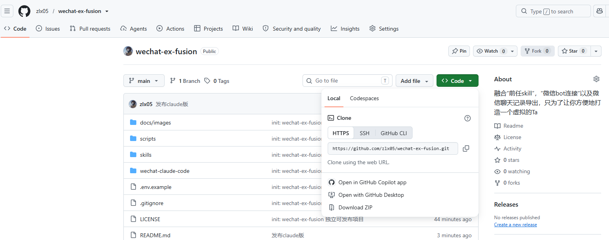
</p>

<p align="center">
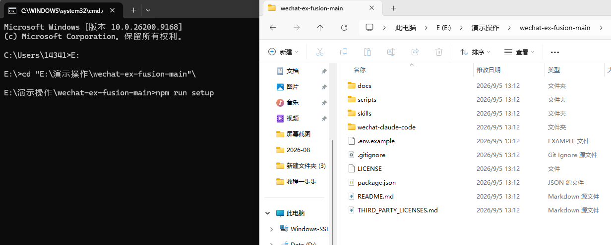
</p>

### 2. 扫码绑定微信

执行 `npm run setup`。**首次运行会自动装依赖、编译、并安装「导出记录」与「创建人设」这两个 skill（约 1–2 分钟）**，然后弹出二维码。

<p align="center">
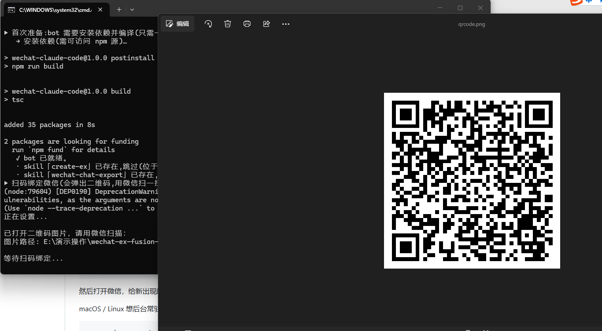
</p>

用手机微信扫一扫，在微信里找到并绑定「微信 ClawBot」插件。

<p align="center">
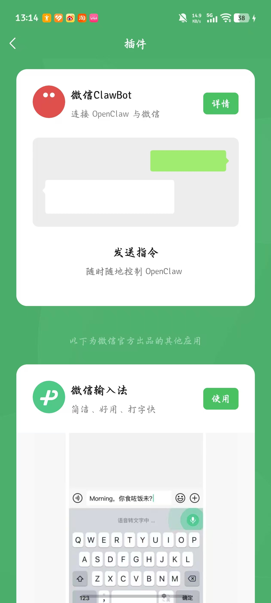
</p>

### 3. 提取聊天记录（可选，但推荐）

执行 `npm run extract` 会自动拉起 Claude Code 并触发「微信聊天记录导出」skill，然后输入对方的微信备注，等待提取完成，结果落在 `exports/` 目录。

> ⚠️ **只对「电脑上已有的记录」有效**——微信电脑版已登录、本地库能解出对话才算。记录若**只在手机里**,请先用其它 GitHub 工具在电脑端导出成 `txt/html/json`(如 **WeChatMsg / 留痕 / PyWxDump**),再走这一步。

<p align="center">
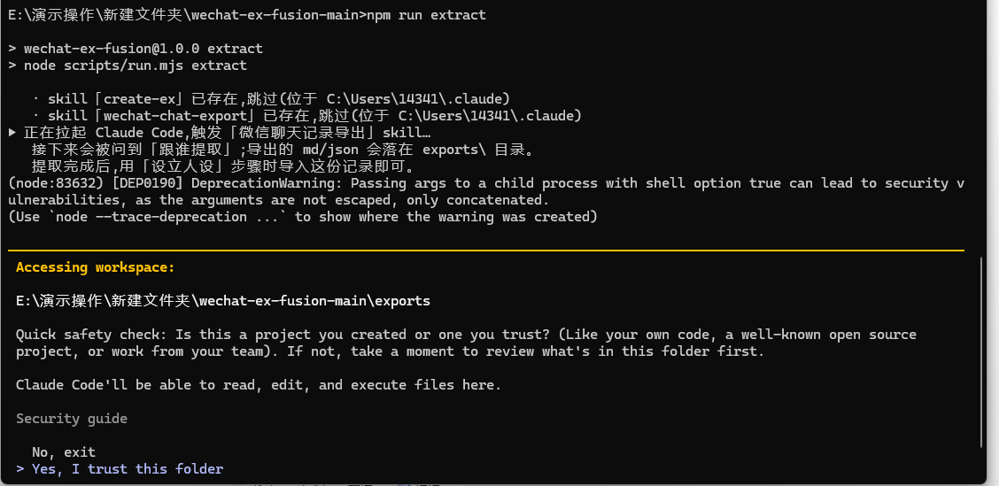
</p>

<p align="center">
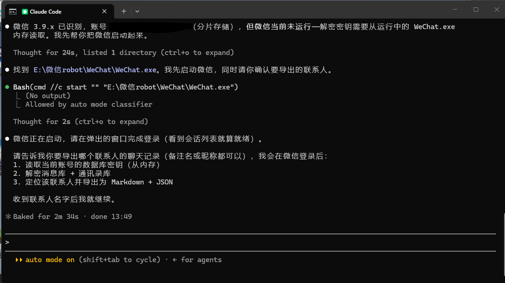
</p>

### 4. 生成前任人设

提取完成后回到终端执行 `npm run persona`，把上一步导出的聊天记录位置告诉 Claude，并导入对方的其它信息（照片等），create-ex 会蒸馏出人设，落在 `exes/<名字>/`。

<p align="center">
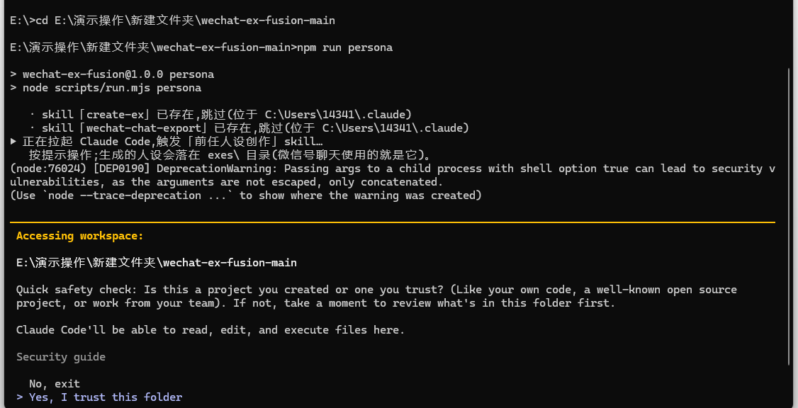
</p>

<p align="center">
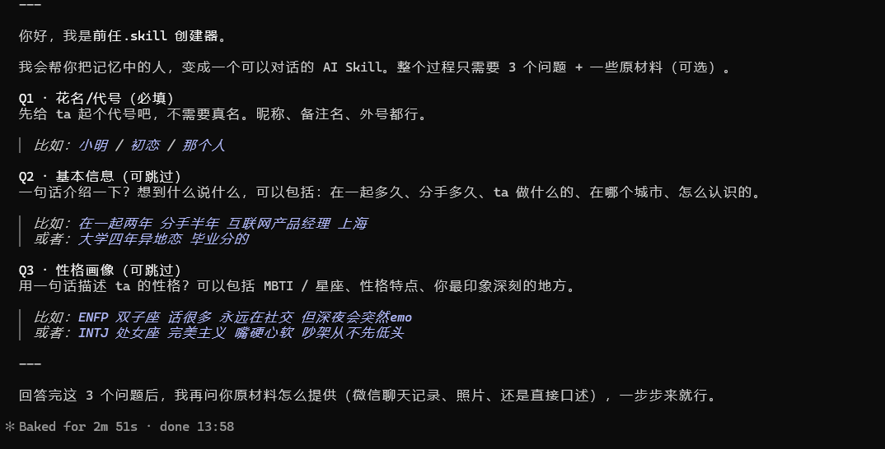
</p>

<p align="center">
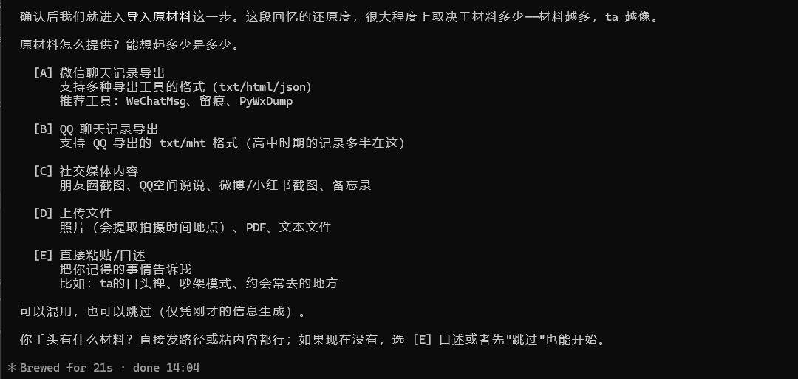
</p>

### 5. 启动机器人开聊

执行 `npm start`，守护进程前台运行。然后打开微信，给出现的那个 AI 机器人好友发条消息——ta 就会像那个人一样跟你聊了。

<p align="center">
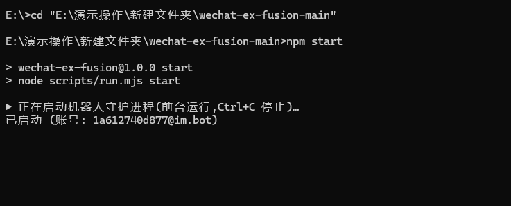
</p>

<p align="center">
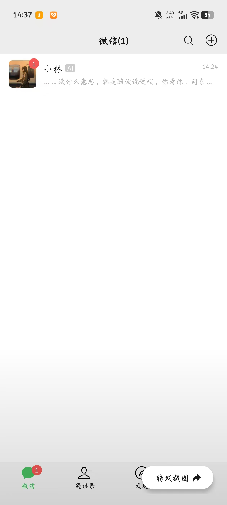
</p>

---

## 💬 微信端命令

直接在微信对话框发：

| 命令 | 说明 |
|---|---|
| `/task [内容]` | 切到任务模式（中性助手），后续对话都算任务；带内容则立即执行 |
| `/chat [内容]` | 切回聊天模式（前任人设）；带内容则立即交给人设回复 |
| `/mode` | 查看当前模式 |
| `/update` | 把最近聊天沉淀进前任人设（自动留版本） |
| `/clear` | **只清当前模式**对话并开新档案，另一模式不受影响，旧档留盘 |
| `/reset` | 完全重置当前模式（含工作目录等设置） |
| `/compact` | 压缩上下文，开始新 Claude 会话（历史保留） |
| `/history [数量]` | 查看最近对话（默认 20 条） |
| `/undo [数量]` | 撤销最近几条对话 |
| `/status` | 查看会话状态（模式 / 工作目录 / 模型 / 会话ID） |
| `/model <名称>` | 切换 Claude 模型 |
| `/cwd <路径>` | 查看 / 切换工作目录 |
| `/prompt <内容>` | 查看 / 设置系统提示词 |
| `/send <路径>` | 发送本地文件（图片直接显示，其他作附件） |
| `/skills` | 列出已安装的 skill |
| `/<skill>` | 触发任意已安装的 skill（如 `/wechat-chat-export`、`/create-ex`） |

---

## ⚙️ 工作原理

```
微信（手机） ←→ iLink Bot API ←→ Node 守护进程（wechat-claude-code） ←→ Claude Code CLI（本地）
```

守护进程通过长轮询监听微信消息，转发给本地 `claude` CLI 处理，回复实时流式推送回微信。全程跑在你自己电脑上。聊天模式用「前任人设」当系统提示，任务模式用中性助手提示，两者在内存与落盘上都是隔离的。

---

## 📁 数据目录与隐私

默认所有数据都在**这个项目目录内**，且已被 `.gitignore` 排除、不会上传：

```
her/            # bot 数据目录：config.json / sessions（会话档案）/ accounts 等
exes/           # 前任人设目录（真人数据）：persona.md / memory.md / SKILL.md / versions/
exports/        # 提取出来的聊天记录（个人数据）
docs/images/.private/   # 含个人信息的本地截图（不打码不公开）
```

> 各环境变量（`WCC_DATA_DIR` / `FUSION_ROOT` / `EXES_DIR` / `HER_SLUG`）可复制 `.env.example` 为 `.env` 覆盖，默认跟随项目目录。

> 🤖 **空闲主动消息（默认开启）**：聊天空闲一阵子（每次随机 2–4 小时），Ta 会主动给你发一条符合人设的短消息（同样遵守"不换行、不发长文"的硬规则），并计入对话历史。想关掉或调整，编辑 数据目录 下的 `config.json`：`"idleProactiveEnabled": false` 关掉；`idleProactiveMinHours` / `idleProactiveMaxHours` 调随机间隔区间；`idleProactiveQuietStart` / `idleProactiveQuietEnd` 调静默时段（默认 23:00–07:00 **后半夜不打扰**：随机时间落在这里就这一轮不发，也不会顺延补发，等你下次发消息再重新计时）。改完**重启 `npm start` 生效**。

**协议与隐私边界**：

- 只导出**你自己电脑**上、**你有权访问**的微信数据；密钥与内容不落盘、不外传。
- 微信数据库解密依赖第三方 `pywxdump`，可能随微信更新失效，且存在合规风险，请自行了解并承担。
- 本项目定位是「把回忆存档、做镜子」，**不鼓励**对前任的不健康执念。如果你发现自己过于沉浸，请寻求专业帮助。


---

## 📄 License

本项目以 [MIT](LICENSE) 许可发布，内含由以下上游项目派生 / 引入的组件，各组件保留其原始 LICENSE：

| 组件 | 作者 / 来源 | 许可 |
|---|---|---|
| wechat-claude-code | [Wechat-ggGitHub](https://github.com/Wechat-ggGitHub/wechat-claude-code) | MIT |
| create-ex | [therealXiaomanChu](https://github.com/therealXiaomanChu/ex-skill) | MIT |
| wechat-chat-export | 本项目作者 | MIT |
| PyWxDump（运行时依赖） | [xaoyaoo/PyWxDump](https://github.com/xaoyaoo/PyWxDump) | 以其发布许可为准 |

详见 [THIRD_PARTY_LICENSES.md](THIRD_PARTY_LICENSES.md)。

---

> 人的记忆是一种不讲道理的存储介质。你记不住高数公式，却清楚记得四年前的一个下午 ta 穿了一件白 T 恤站在便利店门口等你，手里拿着两根冰棍——一根给你，一根 ta 自己。这个工具，就是把那些不公平的记忆，从生物硬盘导到数字硬盘的格式转换器。
